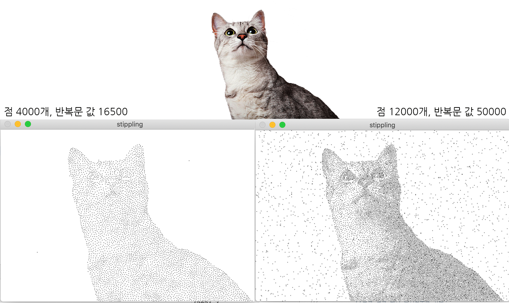
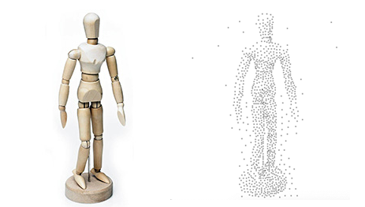
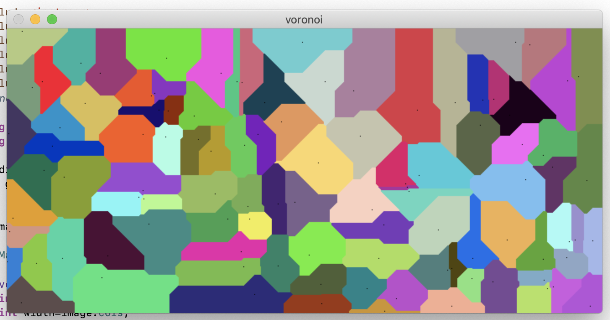
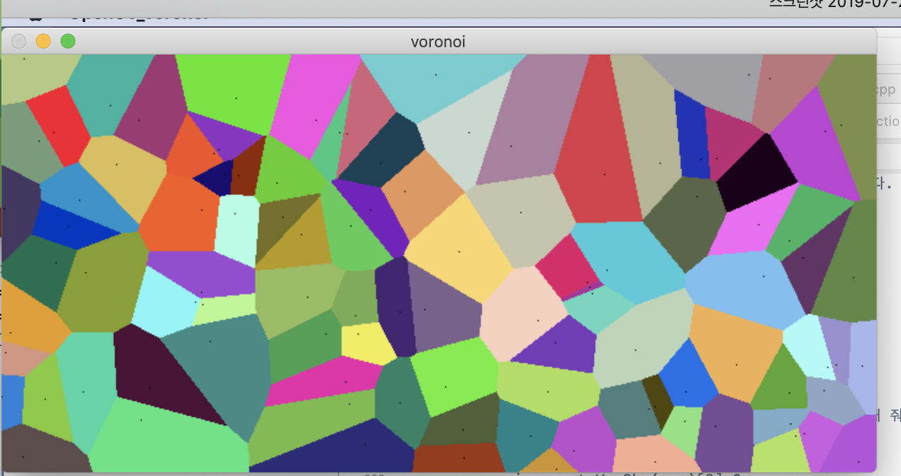
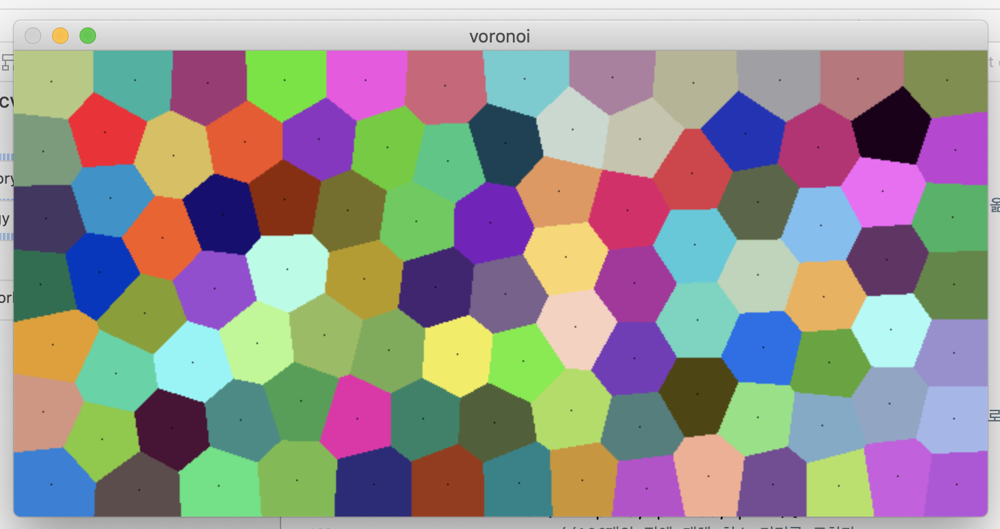

# Weighted Voronoi Stippling

'Weighted Voronoi Sippling' 논문을 읽은 후, 추가적인 교수님의 피드백 및 지시에 따라 진행

---

---

# Summary

### 목표

- 사진 이미지를 input으로 넣으면, Weighted Voronoi Diagram을 이용해 점묘화 느낌의 그림의 output을 산출하는 프로젝트

### Stack

- OpenCV
- C++

### 진행 기간

- 2019.07.12~2019.08.20

    → 2학년 여름방학

---

# 프로젝트 최종 산출물

점 1000개, 반복문 값(voronoi cell 반복 수행값) 12000

# 구현 내용들

### CVD (Centroidal Vornoi Diagram) 구현하기

1. **선행 작업** | Voronoi Diagram
- OpenCV에서 Voronoi Diagram을 만드는 방법
    1. 랜덤하게 n개의 점을 뿌리고, 이중 벡터에 랜덤한 색상과 함께 저장합니다
    2. 이미지의 모든 픽셀에 대해 랜덤하게 뿌린 n개의 점 중 어떤 점과 최소 거리를 가지는지 조사합니다

        → 최소 거리를 갖는 점의 색상으로 해당 픽셀을 채색 (단, `픽셀의 위치 == 점의 위치`일 경우 예외처리)

- 만일 Voronoi Diagram의 cell의 테두리가 깔끔하게 떨어지지 않는 경우

    → 맨하탄 거리 대신 유클리드 거리를 사용하면 해결!

    

    맨하탄 거리를 사용한 경우

    

    유클리드 거리를 사용한 경우

2. Voronoi Diagram에서 **CVD로 변환**하기

- 각 Voronoi Cell의 무게중심 구하기
    1. 이전 Voronoi cell을 만들 때 사용했던 중심 좌표와 대표 색상 외에도 Voronoi cell에 무게중심 좌표와 픽셀 개수 변수를 추가

        → 무게중심 좌표와 픽셀 개수를 0으로 초기화

    2. 이미지의 모든 픽셀을 스캔라인 순서로 순회
        - (Voronoi cell을 만들면서 저장했던)픽셀의 색상과 일치하는 Voronoi cell을 찾습니다
        - cell의 무게중심에 해당 픽셀의 좌표를 더하고 픽셀 개수를 증가시킨 뒤,
            - Voronoi cell의 중심 좌표를 (무게중심 / 픽셀 개수)로 업데이트
    3. 모든 Voronoi cell에 대해 다음 과정 수행
        - 각 보로노이 셀의 무게 중심과 중심 좌표간의 차이를 구해 합산
            - 해당 값이 **일정 값 이상을 초과할 때까지** 다시 1. 로 돌아가 반복 수행합니다
        - 각 보로노이 셀의 무게중심과 픽셀 개수를 0으로 리셋합니다
- 구현 결과

    

### Weighted CVD를 구현하고 점묘화 적용해주기

- CVD를 구현하는 과정에서 무게중심을 계산하는 과정만 수정합니다
    1. 각 픽셀의 좌표를 더할 때, 0~1로 normalize된 해당 픽셀의 밝기를 곱하여 합산
    2. Voronoi cell의 픽셀의 개수로 나눠줄 때,
        - 셀의 픽셀의 개수 → **셀의 픽셀들의 밝기의 총합**으로 나누기
    3. 새로 계산된 무게중심으로 Voronoi cell의 중심을 업데이트하고 CVD를 구현할 때와 마찬가지로 반복
- 업데이트가 완료되면, cell의 중심의 좌표(검정색)를 제외하고 모두 하얀색으로 변경합니다
